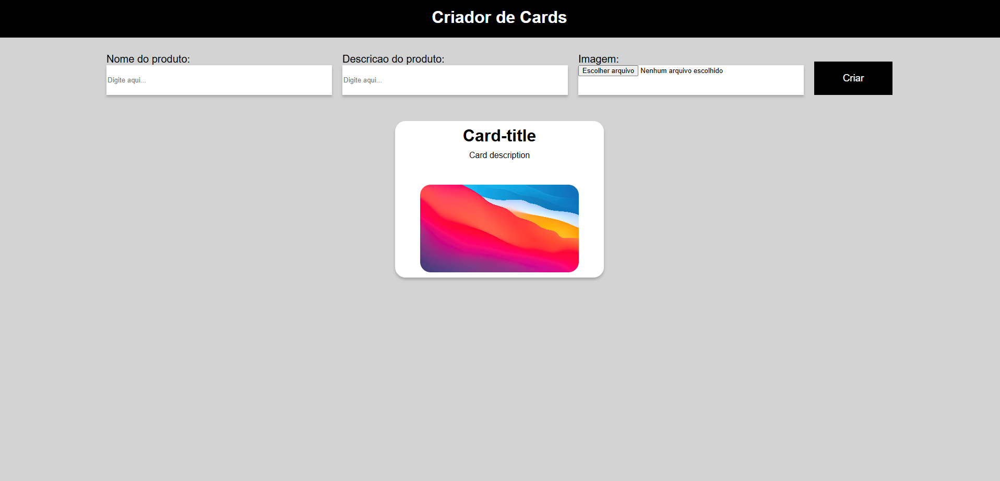

<h1>🃏 Criador de Cards</h1>
Este é um projeto web simples e interativo que permite ao usuário criar cards personalizados com nome, descrição e imagem. Ideal para praticar conceitos básicos de HTML, CSS e JavaScript puro.

<h2>📸 Demonstração</h2>

<h2>🚀 Funcionalidades</h2>
✅ Criação dinâmica de cards com nome, descrição e imagem. 
✅ Leitura de arquivos locais (imagens) com FileReader. 
✅ Validação para impedir criação de cards com campos vazios. 
✅ Layout responsivo para dispositivos móveis. 
✅ Estilo limpo e moderno com CSS puro.

<h2>🧰 Tecnologias Utilizadas</h2>
<li>HTML5</li>
<li>CSS3</li>
<li>JavaScript (Vanilla JS)</li>

<h2>📱 Responsividade</h2>
O layout se adapta automaticamente a telas menores. No modo mobile:
Os inputs ficam empilhados verticalmente.
Cards continuam centralizados e organizados em linhas múltiplas com flex-wrap.

<h2>🛠 Melhorias futuras (sugestões)</h2>
 Adicionar botão para excluir um card. 

 Permitir salvar os cards no LocalStorage. 

 Adicionar campos personalizados (preço, categoria etc.). 

 Adicionar preview da imagem antes da criação do card. 

